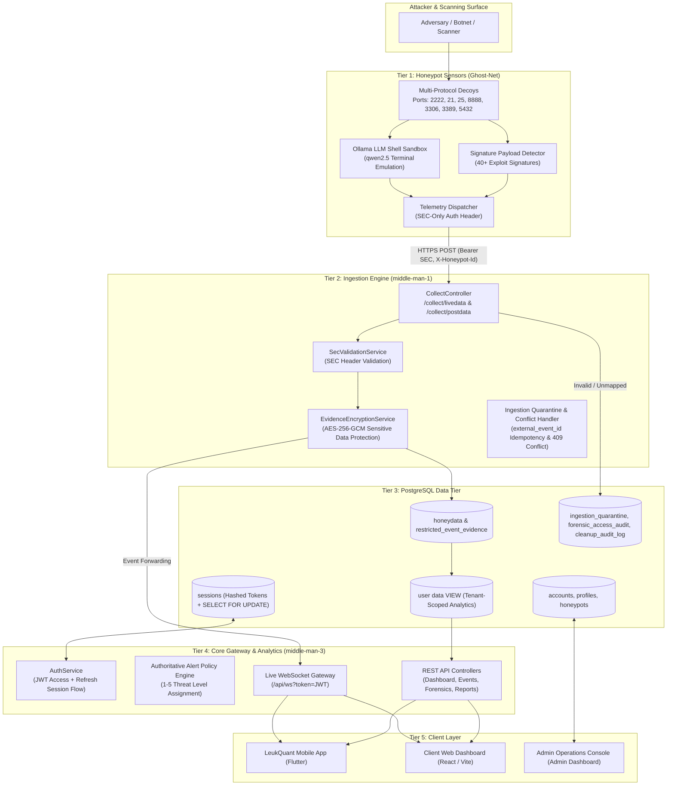

# LeukQuant Backend Architecture Overview (Audited & Codebase-Aligned)

**Document Version:** 2.1.0-AUDITED  
**Status:** Codebase-Aligned Architecture Reference  
**Production Readiness:** Not yet (currently in active staging validation)

---

## 1. System Overview

The **LeukQuant Platform** is a deception-based cyber defense and threat telemetry ecosystem. It lures, captures, and analyzes unauthorized adversarial interactions across honeypot decoys, canary tokens, and scanner activities, transforming raw interaction logs into structured security intelligence.

### Core Architectural Invariants:
1. **Sensor Identity & Subsystems (`detected_by`)**: The field `detected_by` identifies the internal sensor detection subsystem (e.g. `payload_detector`, `classifier_engine`, `canary_tracker`, `honeypot_core`, `ddos_filter`), whereas tenant ownership is bound to relational tenant mappings.
2. **Authoritative Threat Classification**: `middle-man-3` evaluates incoming events and computes threat metrics using a **1–5 integer scale** (where 1 is minimal reconnaissance and 5 is critical compromise/exploit execution).
3. **Strict Separation of Ingestion & Consumption**: `middle-man-1` handles high-throughput honeypot ingestion and encryption, while `middle-man-3` serves authenticated client APIs, analytics, and telemetry broadcasts.

---

## 2. Microservice Layer Breakdown

---

## 3. Detailed Component Specifications

### 3.1 Tier 1: Sensor Infrastructure (`Ghost-Net`)
* **Technology**: Python 3.11+, AsyncIO.
* **Active Decoy Ports**:
  - **SSH Decoy**: Port `2222` (High-interaction shell + Ollama LLM sandbox)
  - **HTTP Honeypot**: Port `8888` (Web vulnerability & path traversal traps)
  - **FTP Decoy**: Port `21` (Command and authentication capture)
  - **SMTP Decoy**: Port `25` (Mail relay and probe logger)
  - **MySQL Decoy**: Port `3306` (Database handshake and query inspection)
  - **RDP Decoy**: Port `3389` (Remote Desktop protocol probe detection)
  - **PostgreSQL Decoy**: Port `5432` (Postgres protocol handshake analysis)
* **Sensor Authentication Scheme**:
  - **Authentication Type**: **SEC-only**
  - **HTTP Request Headers**:
    - `Authorization: Bearer <SEC>`
    - `X-Honeypot-Id: <honeypot_id>`
  - *(Note: Raw user credentials or generic agent tokens are not used for sensor ingestion).*

---

### 3.2 Tier 2: Ingestion & Quarantine Engine (`middle-man-1`)
* **Technology**: **Java 21, Spring Boot 3.4.1**.
* **Ingestion Endpoints**:
  - `POST /collect/livedata`: Stream-oriented telemetry ingestion.
  - `POST /collect/postdata`: Batch/persisted event ingestion.
* **Core Services & Security Controls**:
  - **`SecValidationService`**: Validates the shared sensor encryption secret (SEC) and `X-Honeypot-Id` mapping before processing.
  - **`EvidenceEncryptionService`**: Encrypts sensitive raw payload dumps and credentials using **AES-256-GCM** before database insertion into `restricted_event_evidence`.
  - **Idempotency & Conflict Handling**: Enforces deduplication on `external_event_id`. Cross-agent event ID collisions result in an explicit **HTTP 409 Conflict**.
  - **Quarantine Handling**: Malformed, unmapped, or invalid sensor submissions are routed directly into the `ingestion_quarantine` table for audit and review.

---

### 3.3 Tier 3: PostgreSQL Database Schema & Isolation

| Table / Object | Status | Purpose |
| :--- | :--- | :--- |
| **`accounts`** | Active | User accounts, organizational ownership, and account lifecycle state. |
| **`profiles`** | Active | User profile attributes, company/team associations, and UI preferences. |
| **`honeypots`** | Active | Registered honeypot instances, sensor IDs, assigned ports, and health status. |
| **`sessions`** | Active | Stored refresh token hashes, expiration timestamps, and client device metadata. Uses `SELECT ... FOR UPDATE` pessimistic row locking during token rotation. |
| **`honeydata`** | Active | Canonical immutable security event logs (timestamps, source IP, geo-location, targeted port, protocol, threat level 1–5). |
| **`restricted_event_evidence`** | Active | AES-256-GCM encrypted raw payloads, request headers, and sensitive attack evidence. |
| **`ingestion_quarantine`** | Active | Rejected, unauthenticated, or malformed sensor frames isolated for SOC review. |
| **`forensic_access_audit`** | Active | Audit trail logging access to encrypted forensic evidence and IP session histories. |
| **`cleanup_audit_log`** | Active | Automated data retention and purge execution records. |
| **`push_subscriptions`** | **Planned** | Device VAPID/FCM notification endpoints and key registrations. |
| **`"user data"` (View)** | Active | Tenant-isolated database view filtering `honeydata` by authenticated user profile and honeypots. |

---

### 3.4 Tier 4: Core Gateway & Intelligence (`middle-man-3`)
* **Technology**: **Java 21, Spring Boot 3.4.1, Spring Security, Spring WebSocket**.
* **Base URL**: `https://api.leukquant.com`
* **Threat Classification**:
  - Evaluated on a **1–5 Integer Scale**:
    - **1**: Low-severity reconnaissance / benign port sweep
    - **2**: Suspicious protocol probe or invalid user login attempt
    - **3**: Targeted credential stuffing or known scanner tool signature
    - **4**: Exploit payload injection (SQLi, command injection, path traversal)
    - **5**: Canary token compromise or high-interaction shell breakout attempt

#### Verified REST Endpoints:
* **System & Discovery**:
  - `GET /api/health`: Health status probe.
  - `GET /api/config`: Public frontend configuration and environment descriptors.
* **Authentication & Session (`/api/auth/*`)**:
  - `POST /api/auth/login`: Authenticates credentials; returns JWT access token and sets HTTP-only refresh cookie.
  - `POST /api/auth/refresh`: Rotates refresh token via pessimistic row lock on `sessions` table and issues a new access token.
  - `POST /api/auth/logout`: Revokes active refresh token from `sessions` table.
* **User Operations**:
  - `GET /api/user/profile`: Fetches authenticated user profile, organization, and tenant role.
* **Dashboard & Telemetry (`/api/dashboard/*`)**:
  - `GET /api/dashboard/stats`: Aggregated threat stats, top targeted decoy ports, and score breakdowns.
  - `GET /api/dashboard/events`: Paginated canonical security events (`limit=50`).
  - `GET /api/dashboard/attacks`: Real-time attack volume history and time-series telemetry.
* **Event Forensics & Reports**:
  - `GET /api/events/:id`: Detailed metadata and telemetry attributes for a single event.
  - `PATCH /api/events/:id`: Updates event review or classification metadata.
  - `GET /api/ip/:ip/sessions`: Chronological session connection history and forensics for a specific attacker IP.
  - `GET /api/reports`: Aggregated analytical reports and compliance summaries.

---

### 3.5 Real-Time Telemetry & Alert Transports

#### 1. Live WebSocket Gateway
* **Current Active Implementation**: `wss://api.leukquant.com/api/ws?token=<jwt>`
* **Architecture & Known Limitation**:
  - Currently connects using an in-memory JWT token query parameter.
  - **Phase 3 Planned Upgrade**: Upgrade handshake to single-use, short-lived ticket subprotocol (`leukquant-ticket`, `<ticket>`) to remove long-lived JWTs from URI query strings.
* **Delivery Scope**: Delivers live attack frames while the client application is active.

#### 2. Push Notifications (VAPID / Web Push / FCM)
* **Status**: **Pending / Planned**
* **Target Architecture**: Out-of-band push notification dispatch for backgrounded or closed clients using standard RFC 8291 / RFC 8292 payloads.

---

## 4. Current Implementation Status & Roadmap

| Feature / Subsystem | Current Status | Notes / Target Milestone |
| :--- | :--- | :--- |
| **Ghost-Net Multi-Port Decoys** | **Active (Verified)** | Ports: `2222`, `21`, `25`, `8888`, `3306`, `3389`, `5432` |
| **SEC Sensor Authentication** | **Active (Verified)** | `Authorization: Bearer <SEC>` + `X-Honeypot-Id` |
| **middle-man-1 Ingestion Engine** | **Active (Verified)** | Spring Boot 3.4.1, AES-256-GCM evidence encryption, quarantine table |
| **PostgreSQL Schema & RLS** | **Active (Verified)** | 9 core tables + `"user data"` tenant view |
| **Pessimistic Session Refresh Lock** | **Active (Verified)** | `SELECT ... FOR UPDATE` row lock on PostgreSQL `sessions` |
| **middle-man-3 REST APIs** | **Active (Verified)** | 12 confirmed API routes |
| **1–5 Threat Scoring Engine** | **Active (Verified)** | Canonical integer severity scale |
| **Live WebSocket (`/api/ws?token=`)**| **Active (Verified)** | Active live telemetry feed |
| **WebSocket Ticket Subprotocol** | **Phase 3 (Planned)** | Single-use ticket exchange to eliminate JWT query parameters |
| **VAPID Web Push Dispatch** | **Pending / In Progress**| Schema defined; service integration pending |
| **Production Readiness** | **In Staging Validation**| Undergoing end-to-end integration and security gate verification |
