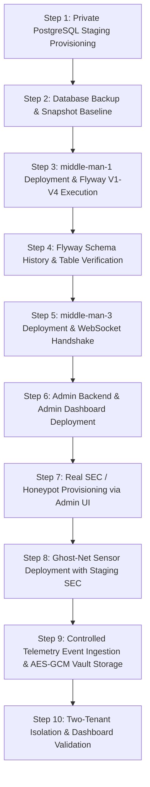

# Coolify Staging Deployment & Verification Execution Log
=========================================================
**Document Version:** 2.0.0-PRO  
**Environment:** Coolify Staging Tier (`staging.leukquant.internal` / Staging VPS)  
**Lead Engineer:** LeukQuant Deployment Verification Lead  
**Date:** 2026-08-17  
**Deployment Status:** `Awaiting Coolify Staging Deployment Logs`  

---

## 1. Staging Service Inventory & Topology

| Service Name | Type | Coolify App ID | Staging Port / Domain | Status | Latest Commit |
| :--- | :--- | :--- | :--- | :---: | :---: |
| **`leukquant-postgres-staging`** | PostgreSQL 16 DB | `srv-pg-staging` | `5432` (Private Internal Network Only) | `Prepared` | N/A |
| **`middle-man-1-staging`** | Spring Boot Ingestion | `srv-mm1-staging` | `8081` (Internal / Agent Ingress) | `Prepared` | `1989edc` |
| **`middle-man-3-staging`** | Spring Boot Analytics | `srv-mm3-staging` | `8080` (Internal WebSocket / API) | `Prepared` | `9f3f206` |
| **`admin-backend-staging`** | Express / Node.js | `srv-adm-be-staging` | `8082` (Internal Admin API) | `Prepared` | `337ef86` |
| **`admin-dashboard-staging`** | React SPA / Express | `srv-adm-fe-staging` | `https://admin-staging.leukquant.com` | `Prepared` | `337ef86` |
| **`client-dashboard-staging`** | React SPA / Nginx | `srv-cli-fe-staging` | `https://dashboard-staging.leukquant.com` | `Prepared` | `a0f27f6` |
| **`ghostnet-staging-sensor`** | Python Honeypot Daemon | `vps-sensor-01` | `2222` (SSH Listener) | `Prepared` | `37f0a01` |

---

## 2. Staging Step-by-Step Execution Sequence



---

## 3. Detailed Execution Step Records

### Step 1: Private PostgreSQL Staging Provisioning
- **Action**: Provision PostgreSQL 16 instance on Coolify internal overlay network.
- **Safety Rule**: No public port forwarding (bound strictly to internal Docker network).
- **Status**: `Awaiting Coolify Staging`
- **Execution Log**: *(Awaiting user Coolify deployment logs)*

### Step 2: Staging Database Backup & Snapshot Baseline
- **Action**: Execute `pg_dump` baseline snapshot before applying migrations.
- **Command**: `pg_dump -h localhost -U postgres -d leukquant_staging > backup_baseline_$(date +%Y%m%d_%H%M%S).sql`
- **Status**: `Awaiting Coolify Staging`
- **Execution Log**: *(Awaiting user backup confirmation)*

### Step 3: middle-man-1 Deployment & Flyway V1–V4 Execution
- **Action**: Deploy `middle-man-1` container image pointing to `leukquant-postgres-staging`.
- **Environment Flags**: `SPRING_PROFILES_ACTIVE=staging`, `APP_PRODUCTION=false`.
- **Expected Flyway Migrations**:
  - `V1__baseline_schema.sql`
  - `V2__canonical_event_contract.sql`
  - `V3__forensic_access_audit.sql`
  - `V4__aes_gcm_evidence_encryption.sql`
- **Status**: `Awaiting Coolify Staging`
- **Flyway Log Output**: *(To be pasted from real Coolify container log)*

### Step 4: Flyway Schema & RBAC Permissions Verification
- **Required Verification Query**:
  ```sql
  SELECT installed_rank, version, description, success
  FROM flyway_schema_history
  ORDER BY installed_rank;
  ```
- **Expected Result**: 4 rows returned with `success = TRUE`.
- **Status**: `Awaiting Coolify Staging`

### Step 5: middle-man-3 Analytics & WebSocket Deployment
- **Action**: Deploy `middle-man-3` container with database credentials and JWT secret.
- **Verification**: `GET /api/health` returns `{"status":"ok"}`. WebSocket endpoint `/api/ws` accepts authenticated connections with `leukquant-ticket` subprotocol or Bearer token header.
- **Status**: `Awaiting Coolify Staging`

### Step 6: Admin Backend & Frontend Deployment
- **Action**: Deploy `admin-backend` (`NODE_ENV=staging`, `COOKIE_SECURE=true`) and `admin-dashboard`.
- **Verification**: Admin login accepts `ADMIN_KEY`, sets `HttpOnly` session cookie, and returns valid CSRF token. `GET /api/health` returns `{"status":"ok"}`.
- **Status**: `Awaiting Coolify Staging`

### Step 7: Real Honeypot & SEC Provisioning via Admin UI
- **Action**: Provision sensor honeypot for `tenant-alpha-test` on `dep-alpha-staging-01`.
- **Verification**:
  - Raw 64-hex SEC displayed once in modal with warning.
  - Network tab inspection proves `sec_hash` is never transmitted to frontend.
  - Provisioning record inserted into audit log.
- **Status**: `Awaiting Coolify Staging`

### Step 8: Ghost-Net Sensor Deployment with Staging SEC
- **Action**: Configure Ghost-Net on staging VPS with `COLLECTOR_URL=https://mm1-staging.leukquant.internal/collect/livedata`, `HONEYPOT_ID`, and encrypted `SEC`.
- **Status**: `Awaiting Coolify Staging`

### Step 9: Controlled Telemetry Event & AES-256-GCM Vault Storage
- **Action**: Trigger synthetic `controlled_test_event` on sensor.
- **Verification**:
  - `middle-man-1` returns HTTP `200 OK`.
  - `honeydata` base table stores event with `credentials = NULL`.
  - `credentials_masked` displays `username:***`.
  - `restricted_event_evidence` stores AES-256-GCM encrypted payload (`ciphertext`, `nonce`, `algorithm`, `encryption_key_id`).
  - Decryption with AAD context (`"tenant:tenant-alpha-test|deployment:dep-alpha-staging-01|event:<eid>"`) succeeds.
- **Status**: `Awaiting Coolify Staging`

### Step 10: Two-Tenant Isolation & Dashboard Verification
- **Action**: Provision second honeypot for `tenant-beta-test`. Send cross-tenant events and verify complete isolation across API queries, WebSockets, and dashboard views.
- **Status**: `Awaiting Coolify Staging`

---

## 4. Staging Validation Sign-off Gate

```text
======================================================
  COOLIFY STAGING READINESS DECISION
======================================================
  Current Staging Status:     Awaiting Coolify Staging Deployment Logs
  Local Preflight Tests:      PASSED (301/301 tests, 0 build errors)
  Staging Logs Supplied:      PENDING
  KRP Pilot Decision:         BLOCKED pending real Coolify staging execution
======================================================
```
