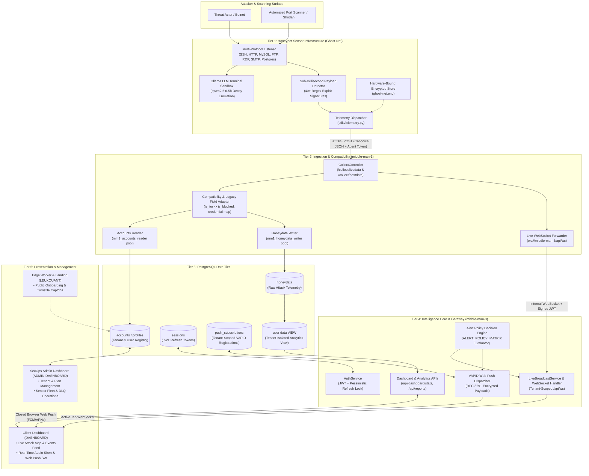
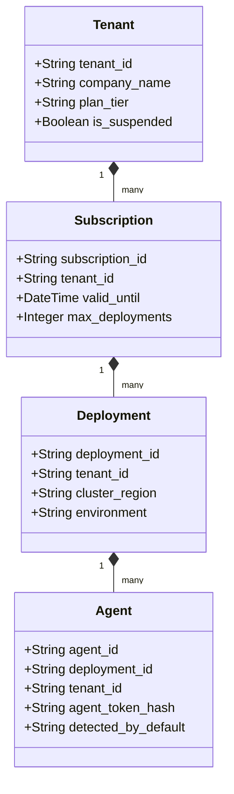

# LeukQuant Ecosystem Architecture (Corrected Baseline)
=====================================================
**Document Version:** 2.0.0-PRO  
**Status:** Canonical Reference Architecture  
**Target Repositories:** `Honey-tech/Ghost-Net`, `middle-man-1`, `middle-man-3`, `DASHBOARD`, `ADMIN-DASHBOARD`, `LEUKQUANT`

---

## 1. Executive Summary & Architectural Invariants

This document establishes the corrected, unified baseline architecture for the **LeukQuant Deception & Cyber Threat Intelligence Platform**. It rectifies architectural ambiguities, unifies tenant isolation boundaries, standardizes payload intelligence schemas, and solidifies alert delivery mechanisms across all microservices.

### Core Architectural Invariants:

1. **`detected_by` Identifies Detection Subsystems, NOT Tenant Identity:**
   - The field `detected_by` designates the sensor module or heuristic engine responsible for flagging the interaction (e.g. `payload_detector`, `classifier_engine`, `canary_tracker`, `honeypot_core`, `ddos_filter`).
   - Tenant ownership is strictly governed by `tenant_id` and its hierarchical entity bindings (`subscription_id`, `deployment_id`, `agent_id`).

2. **Strict Multi-Tenant Scoping:**
   - Every event, telemetry payload, database row, WebSocket broadcast, and push notification is cryptographically or relationally bound to a `tenant_id`.
   - Cross-tenant data inspection or notification leakage is strictly prevented at the database, gateway, and transport layers.

3. **`middle-man-3` is the Authoritative Alert Policy Owner:**
   - Sensor agents (`Ghost-Net`) emit raw telemetry and suggested classifications.
   - `middle-man-3` acts as the single source of truth for evaluating the **Alert Policy Matrix**, deduplicating events, enforcing anti-tampering guards, and deciding alerting actions (`should_alert`, `should_push`, `alert_priority`).

4. **Dual Alerting Transports (Active vs. Closed-Browser):**
   - **Dashboard WebSocket (`/api/ws`)**: Ephemeral, in-memory transport providing sub-second audio sirens, visual banners, and UI animations **only while the browser tab is actively open**.
   - **Backend VAPID Web Push (RFC 8291 / RFC 8292)**: Persistent, push-service-mediated transport dispatched by `middle-man-3` to wake sleeping operating systems and mobile devices **when browsers are closed**.

5. **Stealth Honeypot Personas (No Production Banner Rotation):**
   - Production honeypots must maintain fixed, immutable, OS-consistent banners (e.g. `SSH-2.0-OpenSSH_8.9p1 Ubuntu-3ubuntu0.6`) to prevent fingerprint anomalies that alert sophisticated attackers to honeypot presence. Dynamic banner rotation is restricted to synthetic chaos testing only.

6. **Transition from Email/Password to Agent Credentials:**
   - Telemetry authentication moves away from raw email/password credentials toward deployment-bound agent credentials (`agent_id` + `agent_token_hash`) provisioned through `ADMIN-DASHBOARD`.

7. **Staging Validation Gate:**
   - Enterprise readiness cannot be claimed until the comprehensive end-to-end event contract, tenant isolation, notification delivery, and API integration test suites pass on staging infrastructure.

---

## 2. High-Level Ecosystem Topology



---

## 3. Microservice Roles & Responsibilities

| Service | Technology | Primary Role | Corrected Architectural Responsibility |
| :--- | :--- | :--- | :--- |
| **`Honey-tech/Ghost-Net`** | Python 3.8+, Ollama, Paramiko | Edge Honeypot Sensor | Deceives attackers via realistic Bash emulation; captures payloads in memory; maps MITRE ATT&CK; executes local GeoIP; emits enriched telemetry with `detected_by` subsystem tag and tenant entity IDs. **Fixed production persona (no banner rotation).** |
| **`middle-man-1`** | Java 21, Spring Boot 3.4.1, JPA | Telemetry Ingestion Gateway | Dual-datasource ingestion (`/collect/livedata`, `/collect/postdata`); verifies agent credentials against registry; executes legacy payload compatibility transformation; writes raw events into `honeydata`; streams live attacks to `middle-man-3`. |
| **`middle-man-3`** | Java 21, Spring Boot 3.4.1, WebSocket, Web Push | Threat Intelligence & Gateway API | Master owner of **Alert Policy Matrix**; evaluates alerting decisions; manages multi-tenant JWT and rotating sessions; pushes live WebSocket events to active dashboards; dispatches VAPID Web Push notifications to sleeping devices; serves tenant-isolated REST APIs. |
| **`DASHBOARD`** | React 18, TypeScript, Vite, Tailwind CSS, Leaflet | Client SOC Portal | Visualizes tenant-scoped attack maps, event feeds, and session replays; plays real-time sirens when active; registers Service Worker for background Web Push alerts. |
| **`ADMIN-DASHBOARD`** | React 18, TypeScript, Node.js Backend | Platform Operations Console | Superadmin portal for tenant provisioning, tier assignment (`starter`, `growth`, `enterprise`), suspension toggles, listener health checks, and fleet management. |
| **`LEUKQUANT`** | Cloudflare Workers, TypeScript, D1, Turnstile | Public Edge Services | Manages public landing page, pilot signup requests, contact workflows, Turnstile verification, and edge security headers. |

---

## 4. Entity Scoping Hierarchy & Identity Model

To enforce absolute isolation, all components adhere to the four-tier identity hierarchy:

```
Tenant (tenant_id)
 └── Subscription (subscription_id)
      └── Deployment (deployment_id)
           └── Sensor Agent (agent_id)
```



### Identity Resolution Rules:
1. An `agent_id` is cryptographically and relationally bound to **exactly one** `deployment_id` and `tenant_id`.
2. Telemetry received with an invalid or cross-tenant agent binding is immediately rejected with HTTP `400 / 401`.
3. In legacy compatibility mode, pre-computed hashes (`sec`) or honeypot credentials resolve to an existing `Agent` entity in the registry.

---

## 5. Disentangling `detected_by` from Tenant Identity

In legacy prototypes, `detected_by` was overloaded as a credential hash or user identifier. In the corrected baseline, its definition is strictly normalized:

- **`detected_by` (String)**: Designates the detection component that triggered the event classification.
  - Allowed Values: `"payload_detector"`, `"classifier_engine"`, `"canary_tracker"`, `"honeypot_core"`, `"ddos_filter"`, `"auth_sentinel"`, `"sandbox_guard"`.
- **`tenant_id` (String)**: Unique tenant identifier enforcing data residency, query filtering, and notification routing (e.g. `"tenant-alpha-test"`).
- **`agent_id` (String)**: Specific honeypot daemon instance identifier (e.g. `"agent-eu-01"`).

---

## 6. End-to-End Alerting Architecture

Alerting operates across two complementary pipelines:

```
                            [Security Event Ingested]
                                        │
                                        ▼
                        [middle-man-3 Policy Engine]
                        (Evaluates ALERT_POLICY_MATRIX)
                                        │
                    ┌───────────────────┴───────────────────┐
                    ▼                                       ▼
        [should_alert == true]                    [should_push == true]
                    │                                       │
                    ▼                                       ▼
       [Active Dashboard WebSocket]               [Backend VAPID Web Push]
       (/api/ws?token=JWT)                        (RFC 8291 Payload -> Push Service)
                    │                                       │
        ┌───────────┴───────────┐                           ▼
        ▼                       ▼               [W3C Push Service (FCM/APNs)]
[Interactive Banner]    [Audio Siren]                       │
        │                       │                           ▼
   (Tab is Open)           (Tab is Open)        [OS Notification & Vibration]
                                                (Even when Browser is Closed)
```

### Transport Comparison Matrix:

| Metric / Feature | In-Dashboard WebSocket | Backend VAPID Web Push |
| :--- | :--- | :--- |
| **Endpoint** | `middle-man-3:8080/api/ws` | Push Services (`fcm.googleapis.com`, `apple.com`, etc.) |
| **Active Browser Tab** | Immediate (< 50ms) | Delivered to Service Worker |
| **Closed Browser / Locked OS** | **Disconnected (No delivery)** | **Guaranteed Delivery (Wakes OS / Mobile)** |
| **Audio Alert Capability** | Synthesized Web Audio API sirens | Native OS sound & hardware vibration |
| **Authentication** | Bearer JWT query parameter | VAPID public/private key cryptographic signature |
| **Tenant Scoping** | Tenant-filtered active session set | Tenant-filtered `push_subscriptions` database query |

---

## 7. Honeypot Persona & Stealth Baseline

To prevent adversary detection:
- **Dynamic SSH banner rotation is disabled in production personas.** Attackers fingerprinting SSH implementations across multiple attempts would easily detect a honeypot changing its software version string on every reconnect.
- **Fixed Persona Invariant**: Each deployment binds to a permanent, realistic persona:
  - Default Ubuntu 22.04 LTS: `SSH-2.0-OpenSSH_8.9p1 Ubuntu-3ubuntu0.6`
  - Default Debian 12: `SSH-2.0-OpenSSH_9.2p1 Debian-2+deb12u2`
- Banner randomization is restricted exclusively to synthetic diagnostic/stress testing harnesses.

---

## 8. Enterprise Readiness Gate & Staging Verification

The platform is designated as **Staging Ready** and will achieve **Enterprise Production Ready** status only upon fulfilling the following ledger requirements on live staging infrastructure:

```
[ ] Test Gate 1: End-to-End Canonical Event Contract Validation (14 Payload + 4 Entity Fields).
[ ] Test Gate 2: Legacy Honeypot Ingestion Compatibility Adapter Validation.
[ ] Test Gate 3: Multi-Tenant Data Leakage & Cross-Tenant Query Resistance.
[ ] Test Gate 4: Closed-Browser Web Push Delivery to Sleeping Operating Systems.
[ ] Test Gate 5: Ephemeral WebSocket Isolation & Auto-Reconnection on JWT Expiry.
[ ] Test Gate 6: Hardware-Bound Sensor Config Encryption & Self-Destruct Verification.
```
