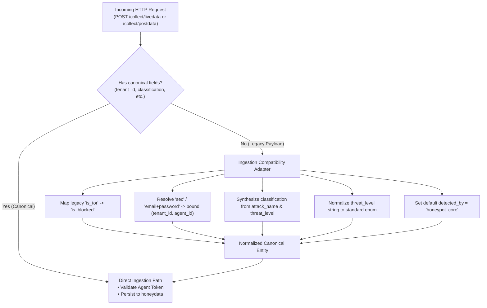

# LeukQuant Event Contract Migration Plan
==========================================
**Document Version:** 2.0.0-PRO  
**Status:** Canonical Migration Specification  
**Target Services:** `Honey-tech/Ghost-Net`, `middle-man-1`, `middle-man-3`, `PostgreSQL`, `DASHBOARD`

---

## 1. Overview & Objectives

The **LeukQuant Event Contract Migration Plan** governs the transition of the security telemetry pipeline from early prototype representations to a deterministic, high-fidelity **Canonical Event Contract**. 

### Migration Objectives:
1. **Preserve 100% Ingestion Backward Compatibility**: Existing honeypots operating in the field using legacy fields (`is_tor`, `sec`, `email`, `password`) will continue to submit telemetry to `/collect/postdata` and `/collect/livedata` without interruption.
2. **Propagate Payload Intelligence Fields**: Map rich classification metrics (`classification`, `classification_confidence`, `classification_score`, `classification_reasons`, `action_taken`, `is_test_event`) through all microservices and database views.
3. **Embed Hierarchical Entity Identifiers**: Include `tenant_id`, `subscription_id`, `deployment_id`, and `agent_id` across the entire ingestion, storage, and presentation path.
4. **Clarify Subsystem Identity**: Disentangle `detected_by` so it strictly identifies the detection engine (e.g. `payload_detector`), not the tenant.

---

## 2. Canonical Event Contract Specification

The canonical event contract contains all required payload intelligence, security classification, entity scoping, and network forensic parameters.

```json
{
  "event_id": "c7a8b3d1-9f2e-4b6a-8e3c-1d5f7a9b2c4e",
  "tenant_id": "tenant-alpha-test",
  "subscription_id": "sub-alpha-001",
  "deployment_id": "dep-alpha-hosting-01",
  "agent_id": "agent-eu-01",
  "honeypot_id": 1,
  "protocol": "SSH",
  "attack_type": "SSH",
  "attack_name": "COMMAND_EXECUTED",
  "classification": "suspected_command_injection",
  "classification_confidence": "high",
  "classification_score": 92,
  "classification_reasons": [
    "Matched critical shell injection pattern: cat /etc/shadow",
    "Sensitive credential file access attempt"
  ],
  "threat_level": "CRITICAL",
  "risk_score": 92.0,
  "detected_by": "payload_detector",
  "action_taken": "observe",
  "is_test_event": false,
  "attacker_ip": "185.220.101.42",
  "source_port": 54321,
  "command_used": "cat /etc/shadow",
  "credentials": "root:admin123",
  "threat_actor": "APT28",
  "is_vpn": false,
  "is_proxy": false,
  "is_blocked": true,
  "country": "Russia",
  "country_code": "RU",
  "region": "Moscow",
  "city": "Moscow",
  "latitude": 55.7558,
  "longitude": 37.6173,
  "timezone": "Europe/Moscow",
  "isp": "Rostelecom",
  "asn": "AS12389",
  "timestamp": "2026-08-14T14:15:00.000Z"
}
```

---

## 3. End-to-End Field Mapping Matrix

| Field Name | Type | Ghost-Net Sensor | Ingestion DTO (`middle-man-1`) | Database Column (`honeydata`) | Intelligence Entity (`middle-man-3`) | Client DTO (`DASHBOARD`) |
| :--- | :--- | :--- | :--- | :--- | :--- | :--- |
| `event_id` | UUID / String | `event_id` | `request.eventId` | `event_id` (BigSerial/UUID) | `SecurityEvent.id` | `event.id` |
| `tenant_id` | String | `tenant_id` | `request.tenantId` | `tenant_id` | `UserData.tenantId` | `event.tenantId` |
| `subscription_id` | String | `subscription_id` | `request.subscriptionId` | `subscription_id` | `UserData.subscriptionId` | `event.subscriptionId` |
| `deployment_id` | String | `deployment_id` | `request.deploymentId` | `deployment_id` | `UserData.deploymentId` | `event.deploymentId` |
| `agent_id` | String | `agent_id` | `request.agentId` | `agent_id` | `UserData.agentId` | `event.agentId` |
| `classification` | String (Enum) | `classification` | `request.classification` | `classification` | `SecurityEvent.classification` | `event.classification` |
| `classification_confidence` | String | `confidence` | `request.classificationConfidence`| `classification_confidence` | `SecurityEvent.confidence` | `event.confidence` |
| `classification_score` | Integer | `classification_score` | `request.classificationScore` | `classification_score` | `SecurityEvent.classificationScore` | `event.classificationScore` |
| `classification_reasons`| JSON Array | `reasons` | `request.classificationReasons` | `classification_reasons` | `SecurityEvent.reasons` | `event.reasons` |
| `detected_by` | String | `detected_by` | `request.detectedBy` | `detected_by` | `SecurityEvent.detectedBy` | `event.detectedBy` |
| `action_taken` | String | `action_taken` | `request.actionTaken` | `action_taken` | `SecurityEvent.actionTaken` | `event.actionTaken` |
| `is_test_event` | Boolean | `is_test_event`| `request.isTestEvent` | `is_test_event` | `SecurityEvent.isTestEvent`| `event.isTestEvent` |
| `threat_level` | String / Int | `threat_level` | `request.threatLevel` | `threat_level` | `SecurityEvent.threatLevel`| `event.threatLevel` |
| `risk_score` | Float / Dec | `risk_score` | `request.riskScore` | `risk_score` | `SecurityEvent.riskScore` | `event.abuseScore` |
| `attacker_ip` | String | `attacker_ip` | `request.attackerIp` | `attacker_ip` | `SecurityEvent.sourceIP` | `event.sourceIP` |
| `command_used` | Text | `command_used` | `request.commandUsed` | `command_used` | `SecurityEvent.payload` | `event.payload` |
| `is_blocked` | Boolean | `is_blocked` | `request.isBlocked` | `is_blocked` | `SecurityEvent.isBlocked` | `event.isBlocked` |
| `timestamp` | ISO-8601 | `timestamp` | `request.timestamp` | `timestamp` | `SecurityEvent.timestamp` | `event.timestamp` |

---

## 4. Ingestion Compatibility Adapter (`middle-man-1`)

To guarantee zero downtime and preserve backward compatibility with legacy sensor deployments, `middle-man-1` executes an Ingestion Adapter transformation on incoming JSON payloads:



### Compatibility Transformation Rules:
1. **`is_tor` $\rightarrow$ `is_blocked`**: If `is_blocked` is null and `is_tor` is present, `is_blocked = is_tor`.
2. **Legacy Identity Mapping**: If `tenant_id` / `agent_id` are absent:
   - Calculate `credentialHash(email, password, AUTH_SALT)` or use supplied `sec`.
   - Query `agents` / `accounts` table to resolve the associated `tenant_id`, `subscription_id`, `deployment_id`, and `agent_id`.
   - If the account registry is empty (development mode), default to internal test tenant `tenant-alpha-test`.
3. **Classification Synthesis**: If `classification` is absent:
   - For SSH command execution $\rightarrow$ default to `"reconnaissance"` (if threat level $\le 2$) or `"credential_attack"` (if auth failure).
   - For SQL queries $\rightarrow$ default to `"suspected_sqli"`.
   - For HTTP 500 error $\rightarrow$ default to `"honeypot_error"`.
   - Generic unmatched $\rightarrow$ default to `"unknown_input"`.

---

## 5. Database Schema Evolution

### 5.1 SQL Migration Script (`honeydata` Schema Extension)

```sql
-- Step 1: Add canonical multi-tenant & hierarchy columns
ALTER TABLE "honeydata" 
    ADD COLUMN IF NOT EXISTS "tenant_id" VARCHAR(100) DEFAULT 'tenant-alpha-test',
    ADD COLUMN IF NOT EXISTS "subscription_id" VARCHAR(100) DEFAULT 'sub-alpha-001',
    ADD COLUMN IF NOT EXISTS "deployment_id" VARCHAR(100) DEFAULT 'dep-alpha-hosting-01',
    ADD COLUMN IF NOT EXISTS "agent_id" VARCHAR(100) DEFAULT 'agent-legacy-01';

-- Step 2: Add canonical payload intelligence columns
ALTER TABLE "honeydata"
    ADD COLUMN IF NOT EXISTS "classification" VARCHAR(100) DEFAULT 'unknown_input',
    ADD COLUMN IF NOT EXISTS "classification_confidence" VARCHAR(20) DEFAULT 'low',
    ADD COLUMN IF NOT EXISTS "classification_score" INTEGER DEFAULT 0,
    ADD COLUMN IF NOT EXISTS "classification_reasons" JSONB DEFAULT '[]'::jsonb,
    ADD COLUMN IF NOT EXISTS "action_taken" VARCHAR(50) DEFAULT 'observe',
    ADD COLUMN IF NOT EXISTS "is_test_event" BOOLEAN DEFAULT FALSE,
    ADD COLUMN IF NOT EXISTS "is_blocked" BOOLEAN DEFAULT FALSE;

-- Step 3: Backfill is_blocked from legacy is_tor where applicable
UPDATE "honeydata" SET "is_blocked" = "is_tor" WHERE "is_blocked" IS FALSE AND "is_tor" IS TRUE;

-- Step 4: Add high-performance query indexes
CREATE INDEX IF NOT EXISTS "idx_honeydata_tenant_timestamp" 
    ON "honeydata" ("tenant_id", "timestamp" DESC);

CREATE INDEX IF NOT EXISTS "idx_honeydata_tenant_classification" 
    ON "honeydata" ("tenant_id", "classification");

CREATE INDEX IF NOT EXISTS "idx_honeydata_event_id" 
    ON "honeydata" ("event_id");

-- Step 5: Update the 'user data' view for middle-man-3
CREATE OR REPLACE VIEW "user data" AS 
SELECT 
    event_id,
    tenant_id,
    subscription_id,
    deployment_id,
    agent_id,
    honeypot_id,
    attack_type,
    attack_name,
    classification,
    classification_confidence,
    classification_score,
    classification_reasons,
    protocol,
    attacker_ip,
    source_port,
    command_used,
    threat_level,
    risk_score,
    threat_actor,
    is_vpn,
    is_proxy,
    is_blocked,
    action_taken,
    is_test_event,
    incident_status,
    assigned_to,
    notes,
    country,
    country_code,
    region,
    city,
    latitude,
    longitude,
    timezone,
    isp,
    asn,
    detected_by,
    credentials,
    timestamp
FROM "honeydata";
```

---

## 6. Anti-Tampering & Test Event Enforcement

To prevent malicious threat actors or unauthorized sensors from triggering false high-priority sirens or suppressing metric calculations:

1. **Unauthenticated Test Flag Sanitization**:
   - Inbound attacker requests submitted to `/collect/livedata` attempting to supply `"is_test_event": true` without administrative JWT tokens are automatically coerced to `"is_test_event": false`.
2. **Controlled SOC Drill Triggering**:
   - Synthetic test events may only be dispatched via authenticated Admin endpoints (`POST /api/v1/admin/test-alert`) where `is_test_event = true` is cryptographically validated.

---

## 7. Migration Phasing & Rollout Schedule

```
┌────────────────────────┐     ┌────────────────────────┐     ┌────────────────────────┐
│  Phase 1: Dual-Ingest  │ ──> │ Phase 2: Staging Gate  │ ──> │   Phase 3: Deprecation │
│ • Apply DB Migrations  │     │ • Full E2E Test Suite  │     │ • Enforce Canonical    │
│ • Deploy Ingestion     │     │ • Validate Multi-Tenant│     │ • Phase Out Legacy     │
│   Adapter in MM1       │     │ • Validate Web Push    │     │   'is_tor' / Passwords │
└────────────────────────┘     └────────────────────────┘     └────────────────────────┘
```

1. **Phase 1: Non-Breaking Dual Ingestion (Current)**
   - Apply schema extensions to PostgreSQL `honeydata` and recreate `user data` view.
   - Deploy `middle-man-1` with the Ingestion Compatibility Adapter.
   - Update `Ghost-Net` telemetry to emit canonical payload intelligence and entity fields.
2. **Phase 2: Staging Validation & Verification**
   - Run end-to-end regression tests across all 13 classification categories.
   - Execute cross-tenant data leakage tests and closed-browser notification delivery tests.
3. **Phase 3: Deprecation of Legacy Identity**
   - Deprecate raw `email` / `password` credentials in telemetry.
   - Enforce mandatory Agent Tokens and strict Four-Way Entity Binding across all deployments.
