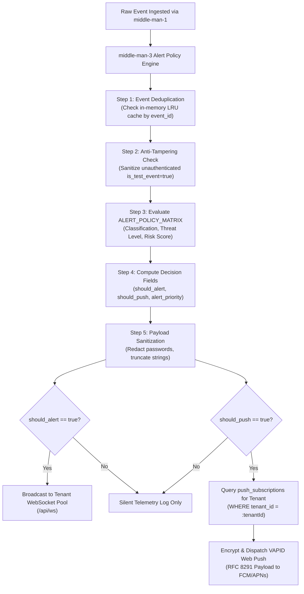
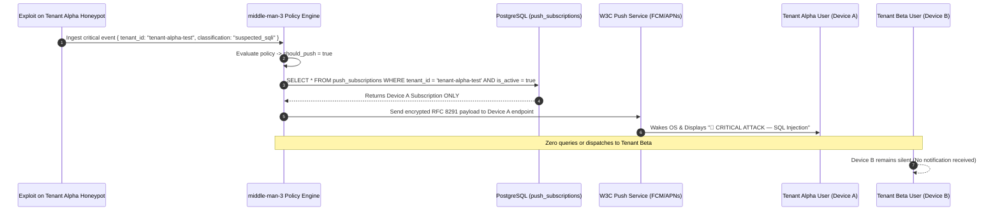

# LeukQuant Backend Notification & Web Push Plan
===================================================
**Document Version:** 2.0.0-PRO  
**Status:** Canonical Alerting Specification  
**Target Services:** `middle-man-3`, `DASHBOARD`, `PostgreSQL`

---

## 1. Executive Summary & Dual Alert Transport

The **LeukQuant Backend Notification Architecture** provides robust, multi-tenant incident alerting for SOC teams across two complementary delivery pipelines:

1. **Active SOC Dashboard (In-Browser WebSocket Transport)**:
   - Sub-50ms latency audio sirens (synthesized Web Audio API), interactive sticky banners, and live map animations.
   - **Operational Limitation**: Operates **only while the browser tab is actively open and connected**. When the browser is closed or suspended, WebSockets disconnect and cannot deliver alerts.
2. **Closed-Browser & Mobile Alerts (Backend VAPID Web Push Transport)**:
   - Dispatched directly by `middle-man-3` via W3C Push Services (Google FCM, Apple APNs, Mozilla, Windows WNS) using RFC 8291 / RFC 8292 standards.
   - **Operational Requirement**: **Required for 24/7 incident response**. Wakes sleeping operating systems, desktop notification centers, and mobile devices even when all browsers are completely shut down.

---

## 2. Alert Policy Ownership (`middle-man-3`)

`middle-man-3` is the **single authoritative owner** of the platform's Alert Policy. The sensor daemon (`Ghost-Net`) merely reports observations and initial classifications; `middle-man-3` executes the final policy determination:



### Policy Evaluation Rules:

| Classification Category | Min Threat Level | Min Risk Score | `should_alert` (WS Siren) | `should_push` (Web Push) | `alert_priority` |
| :--- | :--- | :--- | :---: | :---: | :--- |
| **`unknown_input`** | `LOW` (1) | 0 – 25 | ❌ `false` | ❌ `false` | `NONE` |
| **`honeypot_error`** (HTTP 500) | `LOW` (1) | 0 | ❌ `false` | ❌ `false` | `NONE` |
| **`reconnaissance`** | `LOW` (2) | 20 – 40 | ❌ `false` | ❌ `false` | `INFO` |
| **`suspected_automated_scan`** | `LOW` (2) | 30 – 50 | ❌ `false` | ❌ `false` | `INFO` |
| **`rate_abuse`** | `MEDIUM` (3)| 40 – 65 | ❌ `false` | ❌ `false` | `MEDIUM` |
| **`credential_attack`** | `HIGH` (4) | 70 – 90 |  `true` |  `true` | `HIGH` |
| **`suspected_sqli`** | `CRITICAL` (5)| 80 – 95 |  `true` |  `true` | `CRITICAL` |
| **`suspected_path_traversal`** | `HIGH` (4) | 75 – 90 |  `true` |  `true` | `HIGH` |
| **`suspected_command_injection`**| `CRITICAL` (5)| 85 – 100 |  `true` |  `true` | `CRITICAL` |
| **`payload_download_attempt`** | `CRITICAL` (5)| 85 – 100 |  `true` |  `true` | `CRITICAL` |
| **`canary_interaction`** | `HIGH` (4) | 80 – 95 |  `true` |  `true` | `HIGH` |
| **`cross_protocol_canary_reuse`**| `CRITICAL` (5)| 90 – 100 |  `true` |  `true` | `CRITICAL` |
| **`controlled_test_event`** | `TEST` | 0 – 10 |  `true` |  `true` | `CRITICAL` |

---

## 3. Web Push Backend Architecture (`middle-man-3`)

### 3.1 Standards Compliance
- **RFC 8291**: Message Encryption for Web Push (ECDH over P-256 curve + AES-128-GCM).
- **RFC 8292**: Voluntary Application Server Identification (VAPID) using asymmetric ECDSA signature (P-256 / SHA-256).

### 3.2 Java 21 Web Push Service Implementation

`middle-man-3` incorporates the `nl.martijndwars:web-push` engine powered by BouncyCastle:

```java
@Service
public class WebPushDispatcherService {

    private final PushService pushService;
    private final PushSubscriptionRepository subscriptionRepository;

    public WebPushDispatcherService(
            @Value("${vapid.public.key}") String publicKey,
            @Value("${vapid.private.key}") String privateKey,
            @Value("${vapid.subject}") String subject,
            PushSubscriptionRepository subscriptionRepository) throws GeneralSecurityException {
        
        this.pushService = new PushService(publicKey, privateKey, subject);
        this.subscriptionRepository = subscriptionRepository;
    }

    public void dispatchAlertToTenant(String tenantId, AlertPayload payload) {
        // Enforce strict multi-tenant boundary
        List<PushSubscriptionEntity> subscriptions = subscriptionRepository
                .findByTenantIdAndIsActiveTrue(tenantId);

        String payloadJson = sanitizeAndSerialize(payload);

        for (PushSubscriptionEntity sub : subscriptions) {
            try {
                Subscription webPushSub = new Subscription(
                        sub.getEndpoint(),
                        new Subscription.Keys(sub.getP256dhKey(), sub.getAuthKey())
                );
                Notification notification = new Notification(webPushSub, payloadJson, Urgency.HIGH);
                HttpResponse response = pushService.send(notification);

                if (response.getStatusLine().getStatusCode() == 410 || 
                    response.getStatusLine().getStatusCode() == 404) {
                    // Subscription expired / unregistered -> Deactivate
                    sub.setIsActive(false);
                    subscriptionRepository.save(sub);
                }
            } catch (Exception e) {
                log.warn("Failed push dispatch to endpoint {}: {}", sub.getEndpoint(), e.getMessage());
            }
        }
    }
}
```

---

## 4. Multi-Tenant Push Subscription Schema

Push subscriptions are strictly partitioned by `tenant_id` and `user_id`:

```sql
CREATE TABLE IF NOT EXISTS "push_subscriptions" (
    "id" UUID PRIMARY KEY DEFAULT gen_random_uuid(),
    "tenant_id" VARCHAR(100) NOT NULL,
    "user_id" VARCHAR(100) NOT NULL,
    "endpoint" TEXT NOT NULL UNIQUE,
    "p256dh_key" VARCHAR(255) NOT NULL,
    "auth_key" VARCHAR(255) NOT NULL,
    "user_agent" TEXT,
    "is_active" BOOLEAN DEFAULT TRUE,
    "created_at" TIMESTAMP DEFAULT CURRENT_TIMESTAMP,
    "last_used_at" TIMESTAMP DEFAULT CURRENT_TIMESTAMP
);

CREATE INDEX IF NOT EXISTS "idx_push_tenant_active" 
    ON "push_subscriptions" ("tenant_id", "is_active");
CREATE INDEX IF NOT EXISTS "idx_push_user" 
    ON "push_subscriptions" ("user_id");
```

---

## 5. Strict Cross-Tenant Prevention Guarantees



---

## 6. Payload Sanitization & Privacy Invariants

To comply with data privacy standards and prevent sensitive leakages over public push notification relays:

1. **Zero Credential Exposure**: Real attacker passwords, captured session tokens, and raw SSH keys are **never** embedded in push notification text.
2. **Length Restraints**:
   - `title`: Maximum 80 characters.
   - `body`: Maximum 160 characters.
3. **Standardized Push Payload Schema**:
   ```json
   {
     "event_id": "c7a8b3d1-9f2e-4b6a-8e3c-1d5f7a9b2c4e",
     "tenant_id": "tenant-alpha-test",
     "title": "🚨 CRITICAL ATTACK — SQL Injection",
     "body": "Exploit detected from 185.220.101.42 against Web-Honey-02.",
     "priority": "CRITICAL",
     "url": "/alerts",
     "timestamp": "2026-08-14T14:15:00.000Z"
   }
   ```

---

## 7. REST API Endpoints Specification

### 7.1 Register Push Subscription
- **`POST /api/v1/push/subscribe`**
- **Auth**: `Bearer <JWT>`
- **Request Body**:
  ```json
  {
    "subscription": {
      "endpoint": "https://fcm.googleapis.com/fcm/send/...",
      "keys": {
        "p256dh": "BNcR...",
        "auth": "tB6..."
      }
    },
    "userAgent": "Mozilla/5.0 (Windows NT 10.0; Win64; x64)..."
  }
  ```
- **Response**:
  ```json
  {
    "success": true,
    "message": "Push subscription successfully registered",
    "subscription_id": "8f3b2a1c-..."
  }
  ```

### 7.2 Unregister Push Subscription
- **`POST /api/v1/push/unsubscribe`**
- **Auth**: `Bearer <JWT>`
- **Request Body**: `{ "endpoint": "https://fcm.googleapis.com/fcm/send/..." }`
- **Response**: `{ "success": true, "message": "Push subscription removed" }`

### 7.3 Controlled Admin Test Alert
- **`POST /api/v1/admin/test-alert`**
- **Auth**: `Bearer <JWT>` (Admin Role Required)
- **Request Body**:
  ```json
  {
    "threat_level": "CRITICAL",
    "classification": "suspected_sqli",
    "message": "Controlled SOC Verification Drill"
  }
  ```
- **Response**:
  ```json
  {
    "success": true,
    "event_id": "test-c7a8b3d1-...",
    "dispatched_push_count": 2,
    "is_test_event": true
  }
  ```

---

## 8. Staging Verification & Test Runbook

```
[ ] Test 1: Subscribe browser on Tenant Alpha dashboard and close browser completely.
[ ] Test 2: Trigger synthetic CRITICAL exploit event for Tenant Alpha.
[ ] Test 3: Confirm OS desktop notification displays within 3 seconds on closed browser.
[ ] Test 4: Confirm Tenant Beta devices registered simultaneously received 0 notifications.
[ ] Test 5: Open dashboard and confirm active WebSocket audio siren triggers on new event.
[ ] Test 6: Verify HTTP 500 honeypot_error events produce 0 push notifications.
```
