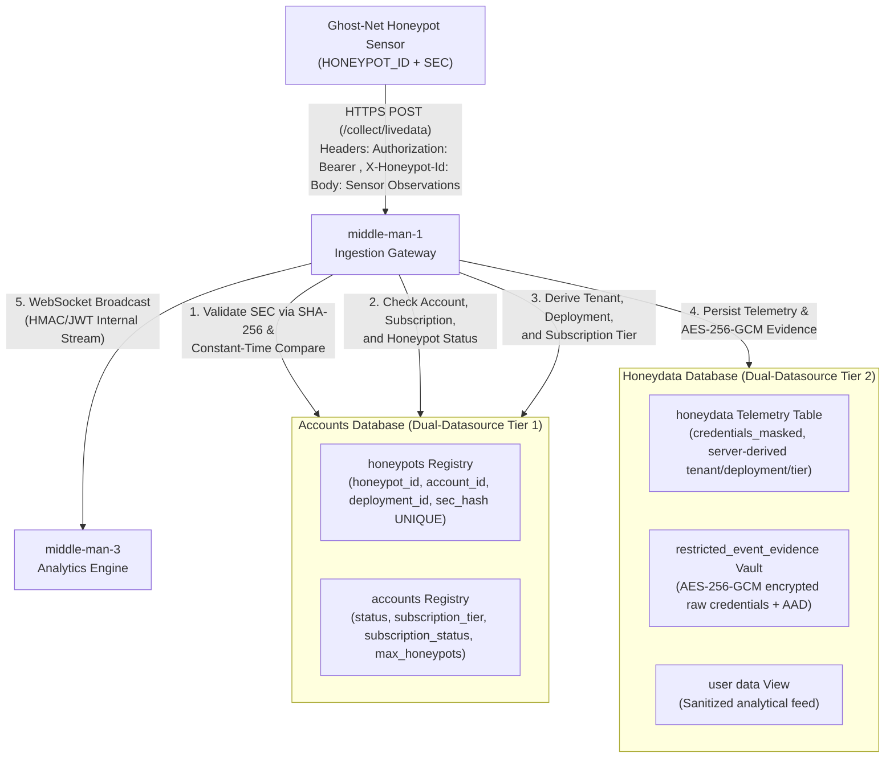

# LeukQuant SEC-Only Sensor Authentication Model
=================================================
**Document Version:** 1.0.0-PRO  
**Target Milestone:** Ghost-Net Sensor Ingestion Authentication Model  
**Date:** 2026-08-16  
**Status:** Approved Architecture Specification  

---

## 1. Architectural Overview & Design Philosophy

LeukQuant employs a streamlined **SEC-Only Authentication Model** for honeypot sensor telemetry ingestion. This model replaces complex sensor-side HMAC token hashing with a direct, secure secret key (`SEC`) transmitted over TLS 1.3 / HTTPS.

### Telemetry Ingestion Sequence



---

## 2. Ingestion Request Contract

### 2.1 Transport Headers (Header-Only Authentication)
Authentication credentials are transmitted **strictly in HTTP request headers**:

| Header Name | Required | Description | Example Format |
| :--- | :---: | :--- | :--- |
| `Authorization` | **YES** | Bearer secret token unique per honeypot | `Bearer <64-hex-char-sec>` |
| `X-Honeypot-Id` | **YES** | Unique honeypot identifier | `hp-alpha-staging-01` |
| `Content-Type` | **YES** | MIME format | `application/json` |

### 2.2 Telemetry JSON Body (Clean Sensor Observations)
The JSON payload contains **only** sensor observations and classifications. Identity fields (`tenant_id`, `account_id`, `subscription_tier`) and credentials (`sec`) are **never** present in the payload:

```json
{
  "event_id": "8f3b2a1c-4d5e-6f7a-8b9c-0d1e2f3a4b5c",
  "external_event_id": "8f3b2a1c-4d5e-6f7a-8b9c-0d1e2f3a4b5c",
  "protocol": "SSH",
  "attack_type": "SSH",
  "attack_name": "SSH_LOGIN_ATTEMPT",
  "attacker_ip": "198.51.100.22",
  "source_port": 54321,
  "command_used": null,
  "threat_level": "HIGH",
  "risk_score": 75.0,
  "credentials": "<captured-attacker-credential>",
  "sensor_classification": "credential_stuffing",
  "sensor_confidence": "high",
  "sensor_score": 85,
  "sensor_reasons": ["Known spray pattern", "Rapid authentication burst"],
  "sensor_suggested_action": "observe",
  "is_vpn": false,
  "is_proxy": true,
  "is_tor": true,
  "is_blocked": false,
  "is_test_event": false,
  "occurred_at": "2026-08-16T00:00:00.000Z"
}
```

---

## 3. Server-Side 6-Step Validation Pipeline

Upon receiving `POST /collect/livedata`, `middle-man-1` executes the following sequence:

1. **Honeypot Lookup**: Query `honeypots` in Accounts DB by `honeypot_id`. If not found $\rightarrow$ reject with `401 Unauthorized` (`"Unknown Honeypot ID"`).
2. **SEC Hash Verification**: Compute `SHA-256(sec)` and compare with stored `sec_hash` using `MessageDigest.isEqual()` (constant-time). If mismatch $\rightarrow$ reject with `401 Unauthorized` (`"Invalid SEC"`).
3. **Honeypot Status Check**: Verify `honeypot.status == 'ACTIVE'`. If `SUSPENDED` or `REVOKED` $\rightarrow$ reject with `403 Forbidden` (`"Honeypot is suspended or revoked"`).
4. **Account Status Check**: Query `accounts` in Accounts DB. Verify `account.status == 'ACTIVE'`. If `SUSPENDED`, `LOCKED`, or `CANCELLED` $\rightarrow$ reject with `423 Locked` (`"Account is suspended or locked"`).
5. **Subscription Status Check**: Verify `account.subscription_status == 'ACTIVE'`. If `EXPIRED`, `CANCELLED`, or `SUSPENDED` $\rightarrow$ reject with `423 Locked` (`"Subscription is expired or cancelled"`).
6. **Server-Side Identity Derivation**:
   - `tenant_id` $\leftarrow$ `account.id`
   - `deployment_id` $\leftarrow$ `honeypot.deployment_id`
   - `subscription_tier_at_ingest` $\leftarrow$ `account.subscription_tier`

---

## 4. Subscription Model & Atomic Plan Limits

### 4.1 Subscription Tiers & Max Honeypots
- **`free`**: `max_honeypots = 1`
- **`starter`**: `max_honeypots = 3`
- **`pro`**: `max_honeypots = 5`
- **`enterprise`**: `max_honeypots = 50`

*Default for unassigned/legacy accounts is `free` (`max_honeypots = 1`). Unknown accounts receive no default Pro privileges.*

### 4.2 Atomic Concurrency Control during Provisioning
Provisioning a new Honeypot executes inside a single transaction with pessimistic locking in the Accounts DB:

```sql
-- Step 1: Pessimistic row lock on the Account
SELECT * FROM accounts WHERE id = :accountId FOR UPDATE;

-- Step 2: Count currently active honeypots
SELECT COUNT(*) FROM honeypots WHERE account_id = :accountId AND status = 'ACTIVE';

-- Step 3: Enforce plan limit
-- If count >= account.max_honeypots -> THROW PlanLimitExceededException (400/403)

-- Step 4: Insert new Honeypot with unique sec_hash
INSERT INTO honeypots (honeypot_id, account_id, deployment_id, sec_hash, name, status)
VALUES (:honeypotId, :accountId, :deploymentId, :secHash, :name, 'ACTIVE');
```

---

## 5. Database Schema Placement

### 5.1 Accounts DB (`accounts` Datasource)

```sql
CREATE TABLE IF NOT EXISTS "accounts" (
    "id" VARCHAR(64) PRIMARY KEY,
    "email" VARCHAR(255) NOT NULL UNIQUE,
    "role" VARCHAR(50) DEFAULT 'USER',
    "status" VARCHAR(50) NOT NULL DEFAULT 'ACTIVE',
    "subscription_tier" VARCHAR(50) NOT NULL DEFAULT 'free',
    "subscription_status" VARCHAR(50) NOT NULL DEFAULT 'ACTIVE',
    "max_honeypots" INTEGER NOT NULL DEFAULT 1,
    "created_at" TIMESTAMP DEFAULT CURRENT_TIMESTAMP,
    "updated_at" TIMESTAMP DEFAULT CURRENT_TIMESTAMP
);

CREATE INDEX IF NOT EXISTS idx_accounts_status ON "accounts"("status");
CREATE INDEX IF NOT EXISTS idx_accounts_subscription ON "accounts"("subscription_status");

CREATE TABLE IF NOT EXISTS "honeypots" (
    "honeypot_id" VARCHAR(100) PRIMARY KEY,
    "account_id" VARCHAR(64) NOT NULL REFERENCES "accounts"("id"),
    "deployment_id" VARCHAR(100) NOT NULL,
    "sec_hash" VARCHAR(255) NOT NULL,
    "name" VARCHAR(255),
    "description" VARCHAR(255),
    "status" VARCHAR(50) NOT NULL DEFAULT 'ACTIVE',
    "created_at" TIMESTAMP WITH TIME ZONE DEFAULT CURRENT_TIMESTAMP,
    "updated_at" TIMESTAMP WITH TIME ZONE DEFAULT CURRENT_TIMESTAMP,
    CONSTRAINT uq_honeypots_sec_hash UNIQUE ("sec_hash")
);

CREATE INDEX IF NOT EXISTS idx_honeypots_account ON "honeypots"("account_id");
CREATE INDEX IF NOT EXISTS idx_honeypots_status ON "honeypots"("status");
```

### 5.2 Honeydata DB (`honeydata` Datasource)
- **`honeydata`**: Telemetry storage with `credentials_masked` (`username:***`).
- **`restricted_event_evidence`**: AES-256-GCM encrypted evidence vault with AAD context (`"tenant:" + tenantId + "|deployment:" + deploymentId + "|event:" + externalEventId`).
- **`ingestion_quarantine`**: Quarantine bucket for malformed events.
- **`cleanup_audit_log`**: Automated retention audit history.
- **`"user data"`**: Read-only sanitized analytical view.

---

## 6. Security Guarantees & Single-View SEC Policy

1. **Unique SEC**: Every Honeypot is provisioned with a unique, 32-byte cryptographically random SEC (64 hex characters).
2. **Single-View Policy**: The raw `SEC` is returned **only once** in the HTTP response upon creation or regeneration (`POST /api/admin/honeypots` / `POST /api/admin/honeypots/:id/regenerate-sec`).
3. **Zero Plaintext Storage**: The database stores only `sec_hash = SHA-256(sec)`.
4. **Zero SEC Exposure**: `sec_hash` and `sec` are never exposed in `GET /api/admin/honeypots`, audit logs, WebSocket feeds, or UI lists.
5. **Constant-Time Verification**: Uses `MessageDigest.isEqual()` to prevent timing side-channel attacks.
6. **Internal Backend Security**: Streaming between `middle-man-1` and `middle-man-3` continues using authenticated HMAC/JWT over WebSocket.
