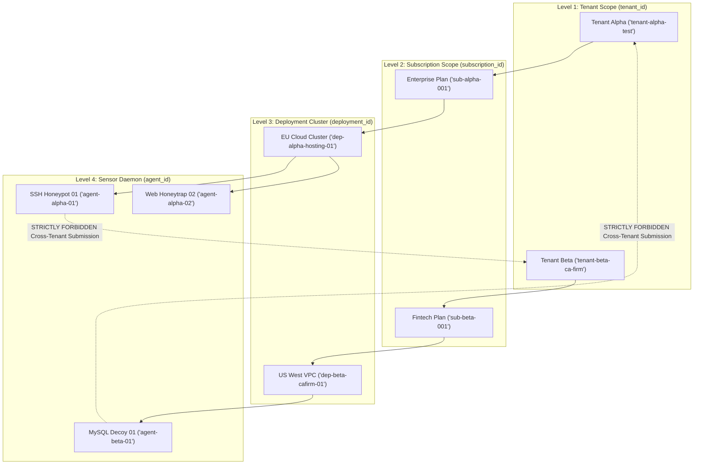
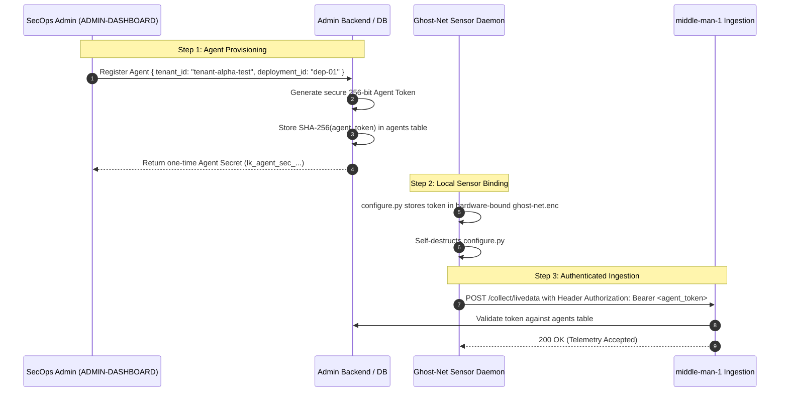

# LeukQuant Multi-Tenant Runtime Isolation Migration Plan
==========================================================
**Document Version:** 2.0.0-PRO  
**Status:** Canonical Security Specification  
**Target Services:** `Ghost-Net`, `middle-man-1`, `middle-man-3`, `PostgreSQL`, `DASHBOARD`, `ADMIN-DASHBOARD`

---

## 1. Threat Model & Isolation Objectives

In multi-tenant SaaS environments, **cross-tenant data leakage** and **cross-tenant alert pollution** represent critical security vulnerabilities. An enterprise customer (Tenant A) must never be able to view, query, or receive alert notifications for security events belonging to another customer (Tenant B).

```
   ┌─────────────────────────────────────────────────────────────────┐
   │                     CROSS-TENANT THREAT VECTORS                 │
   │                                                                 │
   │ 1. Telemetry Spoofing: Agent A submits event into Tenant B data │
   │ 2. Query Leakage: Tenant A API request returns Tenant B records │
   │ 3. Broadcast Bleed: Tenant A WebSocket receives Tenant B sirens │
   │ 4. Push Leak: Tenant A user receives Tenant B Web Push alert    │
   └─────────────────────────────────────────────────────────────────┘
```

### Core Migration Objectives:
1. **Four-Tier Entity Hierarchy**: Bind all data strictly to `(tenant_id, subscription_id, deployment_id, agent_id)`.
2. **Disentangle `detected_by`**: Re-establish `detected_by` strictly as a detection subsystem tag, moving all tenant authorization to explicit `tenant_id` fields.
3. **Database-Level Isolation**: Enforce mandatory tenant filtering (`WHERE tenant_id = ?`) across all repository queries and database views.
4. **WebSocket & Push Isolation**: Partition active WebSocket channels and Web Push dispatches strictly by `tenant_id`.
5. **Deployment-Bound Credentials**: Transition from shared email/password authentication to cryptographically bound Agent Tokens.

---

## 2. Four-Way Entity Scoping Hierarchy

Every asset, sensor, event, command, and subscription in the LeukQuant ecosystem is bound to a strict four-level hierarchy:



### Entity Scoping Invariants:
1. **Immutable Binding**: An `agent_id` is registered to exactly one `(tenant_id, subscription_id, deployment_id)`.
2. **Zero Default Fallback in Production**: In production mode, any incoming event lacking a valid, registered `agent_id` and `tenant_id` is immediately rejected. No fallback to a default or global tenant is permitted.
3. **Cross-Tenant Prevention**: An agent bound to `tenant-alpha-test` cannot emit events or modify resources belonging to `tenant-beta-ca-firm`.

---

## 3. Disentangling `detected_by` from Tenant Identity

### Current (Legacy Overloaded) vs. Corrected State:

| Context | Legacy Implementation (Incorrect) | Corrected Architecture (Canonical) |
| :--- | :--- | :--- |
| **`detected_by` Column** | Stored the SHA-256 hash of `email:password:salt` (used as tenant identifier). | Stores the name of the detection module (e.g. `"payload_detector"`, `"canary_tracker"`, `"classifier_engine"`). |
| **Tenant Ownership** | Inferred implicitly from the `detected_by` hash value. | Explicitly governed by `tenant_id` column present in all tables and JWT claims. |
| **Honeypot Identification**| `honeypot_id` (numeric integer). | Hierarchical `(tenant_id, deployment_id, agent_id)`. |

---

## 4. Multi-Tenant Database Isolation Strategy

### 4.1 Table Schema Updates & Partitioning

```sql
-- Step 1: Create dedicated Agent Registry Table
CREATE TABLE IF NOT EXISTS "agents" (
    "agent_id" VARCHAR(100) PRIMARY KEY,
    "deployment_id" VARCHAR(100) NOT NULL,
    "tenant_id" VARCHAR(100) NOT NULL,
    "subscription_id" VARCHAR(100) NOT NULL,
    "agent_token_hash" VARCHAR(255) NOT NULL,
    "description" VARCHAR(255),
    "is_active" BOOLEAN DEFAULT TRUE,
    "created_at" TIMESTAMP DEFAULT CURRENT_TIMESTAMP,
    "updated_at" TIMESTAMP DEFAULT CURRENT_TIMESTAMP
);

-- Step 2: Index agents table for high-speed authorization lookups
CREATE INDEX IF NOT EXISTS "idx_agents_auth" ON "agents" ("agent_id", "agent_token_hash");
CREATE INDEX IF NOT EXISTS "idx_agents_tenant" ON "agents" ("tenant_id");

-- Step 3: Seed internal validation agents
INSERT INTO "agents" ("agent_id", "deployment_id", "tenant_id", "subscription_id", "agent_token_hash", "description")
VALUES 
('agent-alpha-01', 'dep-alpha-hosting-01', 'tenant-alpha-test', 'sub-alpha-001', '04537780243bf121bbc8b8a3076d600a2f4bc4d824c350aeb38476704662df8f', 'Alpha Test SSH Honeypot'),
('agent-beta-01', 'dep-beta-cafirm-01', 'tenant-beta-ca-firm', 'sub-beta-001', 'e3b0c44298fc1c149afbf4c8996fb92427ae41e4649b934ca495991b7852b855', 'Beta Test HTTP Decoy')
ON CONFLICT (agent_id) DO NOTHING;
```

### 4.2 Repository Query Isolation (`middle-man-3`)

All Spring Data JPA repositories in `middle-man-3` are refactored to enforce tenant-scoped queries:

```java
// UserDataRepository.java
public interface UserDataRepository extends JpaRepository<UserData, Long> {

    // Tenant-isolated attack metric queries
    @Query("SELECT COUNT(u) FROM UserData u WHERE u.tenantId = :tenantId")
    long countTotalAttacksByTenant(@Param("tenantId") String tenantId);

    @Query("SELECT u FROM UserData u WHERE u.tenantId = :tenantId ORDER BY u.timestamp DESC")
    List<UserData> findRecentEventsByTenant(@Param("tenantId") String tenantId, Pageable pageable);

    @Query("SELECT u FROM UserData u WHERE u.tenantId = :tenantId AND u.eventId > :lastEventId")
    List<UserData> findNewEventsByTenant(@Param("tenantId") String tenantId, @Param("lastEventId") Long lastEventId);
}
```

---

## 5. Gateway & API Layer Tenant Isolation

### 5.1 JWT Token Claims Structure

When a user logs in via `POST /api/auth/login`, `middle-man-3` embeds the authenticated user's `tenant_id` and `role` directly into the signed JWT claims:

```json
{
  "sub": "user-uuid-12345",
  "email": "soc-lead@alpha-hosting.com",
  "tenant_id": "tenant-alpha-test",
  "subscription_id": "sub-alpha-001",
  "role": "enterprise",
  "iat": 1723636800,
  "exp": 1723637700
}
```

### 5.2 Security Context Propagation

The `JwtAuthFilter` extracts `tenant_id` from the verified token and stores it in the Spring `SecurityContext`:

```java
String tenantId = jwtService.extractTenantId(token);
TenantAuthenticationToken auth = new TenantAuthenticationToken(principal, tenantId, authorities);
SecurityContextHolder.getContext().setAuthentication(auth);
```

Every REST controller retrieves `tenantId` exclusively from the verified context, completely preventing parameter tampering (e.g. `?tenant_id=other_tenant`).

---

## 6. Real-Time Transport Isolation (WebSocket & Push)

### 6.1 WebSocket Multi-Tenant Partitioning

```java
@Component
public class LiveAttackHandler extends TextWebSocketHandler {
    // Map of tenant_id -> Set of active WebSocket sessions
    private final Map<String, Set<WebSocketSession>> tenantSessions = new ConcurrentHashMap<>();

    @Override
    public void afterConnectionEstablished(WebSocketSession session) {
        String tenantId = (String) session.getAttributes().get("tenant_id");
        tenantSessions.computeIfAbsent(tenantId, k -> new CopyOnWriteArraySet<>()).add(session);
    }

    public void broadcastAttackToTenant(String targetTenantId, Object attackEvent) {
        Set<WebSocketSession> sessions = tenantSessions.get(targetTenantId);
        if (sessions == null || sessions.isEmpty()) return;

        TextMessage message = new TextMessage(objectMapper.writeValueAsString(attackEvent));
        for (WebSocketSession session : sessions) {
            if (session.isOpen()) {
                session.sendMessage(message);
            }
        }
    }
}
```

### 6.2 Web Push Multi-Tenant Partitioning

When an event triggers `should_push = true`, the dispatcher queries push subscriptions matching **only** the event's `tenant_id`:

```java
List<PushSubscription> recipients = pushSubscriptionRepository
    .findByTenantIdAndActiveTrue(event.getTenantId());
```

Users in Tenant B will **never** receive push notifications for incidents occurring in Tenant A.

---

## 7. Migration from Email/Password to Agent Tokens



---

## 8. Staging Verification & Cross-Tenant Breach Test Matrix

| Test Case ID | Test Objective | Procedure | Expected Result | Status |
| :--- | :--- | :--- | :--- | :--- |
| **TEST-ISO-01** | Cross-Tenant Query Resistance | Tenant Alpha user requests `/api/dashboard/events` | Response contains 0 records belonging to Tenant Beta | Required for Staging |
| **TEST-ISO-02** | Cross-Tenant WS Isolation | Emit critical attack on Tenant Beta sensor | Tenant Alpha WebSocket receives 0 frames | Required for Staging |
| **TEST-ISO-03** | Cross-Tenant Push Isolation | Trigger exploit on Tenant Alpha sensor | Tenant Beta mobile devices receive 0 push alerts | Required for Staging |
| **TEST-ISO-04** | Agent Identity Spoofing | Agent Alpha submits event with `tenant_id="tenant-beta-ca-firm"` | Ingestion rejects with HTTP `400 / 401` | Required for Staging |
| **TEST-ISO-05** | Unconfigured Production Guard | Launch Ghost-Net in prod without `tenant_id` | Daemon halts with `RuntimeError` | Required for Staging |
