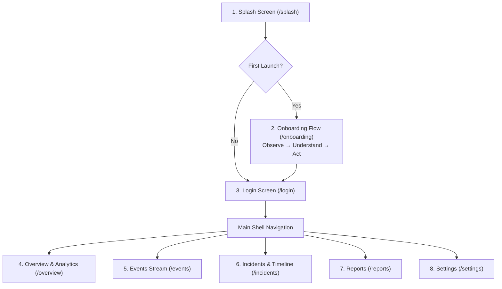

# LeukQuant Mobile

**LeukQuant Mobile** is a modernized, calm enterprise security monitoring client built with Flutter Material 3, Riverpod, GoRouter, and `fl_chart`.

This application delivers a high-contrast, non-sensationalist design for security operations without matrix rain, cyberpunk neon, hacker terminal tropes, or fake live SOC counters.

---

## Key Design Principles & Modern Styling

- **Enterprise Material 3**: Crisp, high-contrast layouts tailored for professional SOC analysts and security teams.
- **20–28px Rounded Card Architecture**: Modern cards on light blue ambient background with soft shadows and generous white space.
- **Calm, Tailored Brand Palette**:
  - Primary: `#2563EB`
  - Primary Dark: `#1D4ED8`
  - Primary Soft: `#DBEAFE`
  - Primary Very Light: `#EFF6FF`
  - Dark Theme Primary: `#60A5FA`
  - Dark Theme Surface: `#172033`
  - Dark Theme Background: `#111827`
- **Strict Privacy by Design**: All credentials and sensitive honeytoken secrets are strictly masked (`admin / **********`).
- **Clean Release vs. Debug States**: In release mode, the app presents calm empty/pending states (*"Awaiting backend data"* and *"Awaiting organisation data"*). In debug mode (`kDebugMode`), a demo preview toggle allows reviewing populated event sheets, charts, and timelines.

---

## Navigation & Screen Flow



---

## Screens Breakdown

### 1. Splash Screen (`/splash`)
- Minimalist geometric shield emblem (`LeukQuantLogo`)
- Subtitle: *"Security Monitoring"*
- Smooth fade transition with automated router redirection based on onboarding state

### 2. Onboarding Flow (`/onboarding`)
Three original LeukQuant onboarding pages:
1. **Observe**: *"See suspicious activity early"* — Ghost-Net observes interaction with controlled decoy services before attackers reach real systems.
2. **Understand**: *"Understand every security event"* — Turn complex security signals into clear timelines, severity, and recommended actions.
3. **Act**: *"Act with confidence"* — Receive verified incident updates and keep your organisation informed.
- Vector illustrations crafted from Flutter CustomPainter shapes
- Skip button, animated pill pagination dots, and Back/Next/Get Started buttons
- Persisted completion in `shared_preferences`

### 3. Login Screen (`/login`)
- Clean enterprise sign-in card with 24px radius
- Work Email & Obscurable Password fields with input validation
- Theme toggle in the header bar
- In-memory UI authentication (no tokens in storage)

### 4. Overview & Analytics Screen (`/overview`)
- **Top Bar**: *"Security Overview"*, Organisation name (or *"Awaiting organisation data"*), theme toggle, and notification bell
- **Deployment Health**: Cluster posture status (*"Standby / Awaiting backend"*)
- **Critical Incidents & High-Risk Events**: Responsive metric cards
- **Last Event Received**: Ingress stream timestamp status
- **Analytics Charts** (Powered by `fl_chart`):
  - **Security Activity Line Chart**: 24-hr verified events over time with empty state
  - **Threat Distribution Donut Chart**: Reconnaissance, Credential Attack, Canary Interaction, Critical Incident
  - **Protocol Activity Bar Chart**: SSH, HTTP, MySQL, FTP, SMTP
- **Recommended Action Card**: Actionable guidance
- **Recent Activity Section**: Reusable empty state view when awaiting backend data

### 5. Events Screen (`/events`)
- Search bar (by Event ID, Source IP, Protocol, Classification)
- Severity filter chips (*All, Critical, High, Warning, Info*)
- Protocol filter chips (*All, SSH, HTTPS, PostgreSQL, DNS*)
- Stream status counter badge
- Event list cards with severity dots and formatted timestamps
- **Event Details Bottom Sheet**:
  - Event ID & Classification reasons
  - Telemetry parameters: Protocol, Port, Source IP, Country, Canary Reference
  - Actionable recommendation
  - **Masked credentials only** (`admin / **********`)

### 6. Incidents Screen (`/incidents`)
- Incident tracking cards with containment status, scope, and assignee
- Reusable empty state view (*"No Active Incidents"*)
- Interactive **Audit Timeline Stepper** (*Detection → Correlation → Triage & Containment → Resolution*)

### 7. Reports Screen (`/reports`)
- **7-Day Security Brief**, **Incident Audit Log**, **Monthly Security Digest**
- Clear *"Backend report generation service pending"* banner
- Disabled export buttons with explanatory note

### 8. Settings Screen (`/settings`)
- Analyst Profile Card (*"Awaiting profile data"*)
- 3-way Theme Selector: **System**, **Light**, **Dark** (persisted via `shared_preferences`)
- In-App Alert Preference Switch
- Push Notification Status (*"Backend push service pending"*)
- Debug Demo Preview toggle (visible in debug builds only)
- Sign Out button with confirmation dialog

---

## Running & Testing

### Running Tests
```bash
flutter test
```

### Static Analysis
```bash
flutter analyze
```

### Live Interactive Web & Emuluxe Preview
```bash
# Run the local preview server on http://localhost:5050
node web_preview/server.js
```
*Open `http://localhost:5050` in Emuluxe or your browser.*
